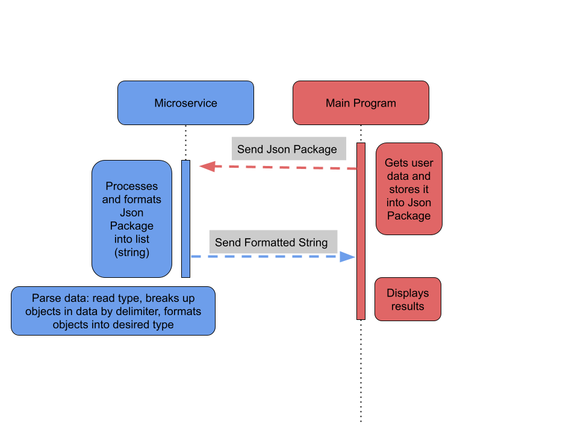

How to call the micorservice: 
1. Establish a "requester" connect it to the appropiate port.
    Code {
        const requester = new zmq.Request();
        await requester.connect("tcp://127.0.0.1:5555");
        }

2. Create a json package that contains the kind of list you would like (type), the contents of the list (Milk\Eggs\nBread), and the deilimter used to
   seperate the items of the list. This would porbably be done by taking user input, but this is what the json package would look like.
   Code {
        const jsonData = { type: "grocery_list", text: " ", delimiter: "\n" };
        }

3. Then send the json package as a string via the established requster.
    Code {
        await requester.send(JSON.stringify(jsonData));
        }

How to recieve data from microservice:
1. After sending proper data to the microservice just call the requester to recive a string from the microservice.
    Code {
        const [reply] = await requester.receive();
        }

2. Then call .toString to use the recived data as a string.
    Code {
        console.log("formatted list:\n", reply.toString());
        }

